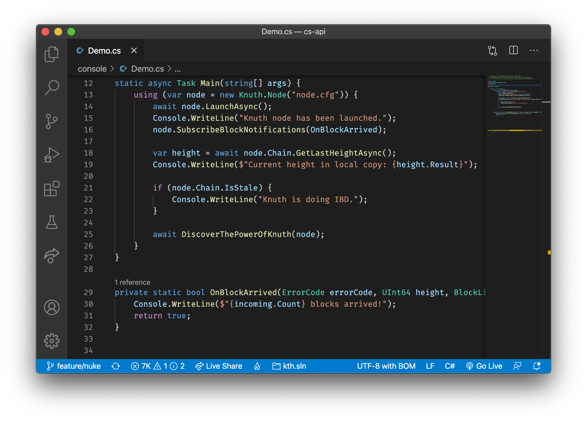

# Knuth C# API <a target="_blank" href="https://github.com/k-nuth/cs-api/releases">![Github Releases][badge.release]</a> <a target="_blank" href="https://travis-ci.org/k-nuth/cs-api">![Build status][badge.Travis]</a> <a target="_blank" href="https://ci.appveyor.com/projects/k-nuth/cs-api">![Build Status][badge.Appveyor]</a> <a href="#">![C][badge.c]</a> <a target="_blank" href="https://t.me/knuth_cash">![Telegram][badge.telegram]</a> <a target="_blank" href="https://k-nuth.slack.com/">![Slack][badge.slack]</a>

> Bitcoin full node as a C# library

Repository under construction, the first version will be released shortly.

<!-- Links -->
[badge.Travis]: https://travis-ci.org/k-nuth/cs-api.svg?branch=master
[badge.Appveyor]: https://ci.appveyor.com/api/projects/status/github/k-nuth/cs-api?svg=true&branch=master
[badge.Cirrus]: https://api.cirrus-ci.com/github/k-nuth/cs-api.svg?branch=master
[badge.version]: https://badge.fury.io/gh/k-nuth%2Fkth-cs-api.svg
[badge.release]: https://img.shields.io/github/release/k-nuth/cs-api.svg
[badge.c]: https://img.shields.io/badge/C-11-blue.svg?style=flat&logo=c
[badge.telegram]: https://img.shields.io/badge/telegram-badge-blue.svg?logo=telegram
[badge.slack]: https://img.shields.io/badge/slack-badge-orange.svg?logo=slack
